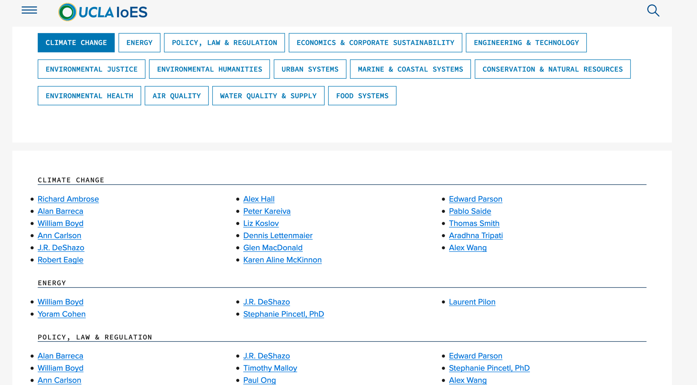
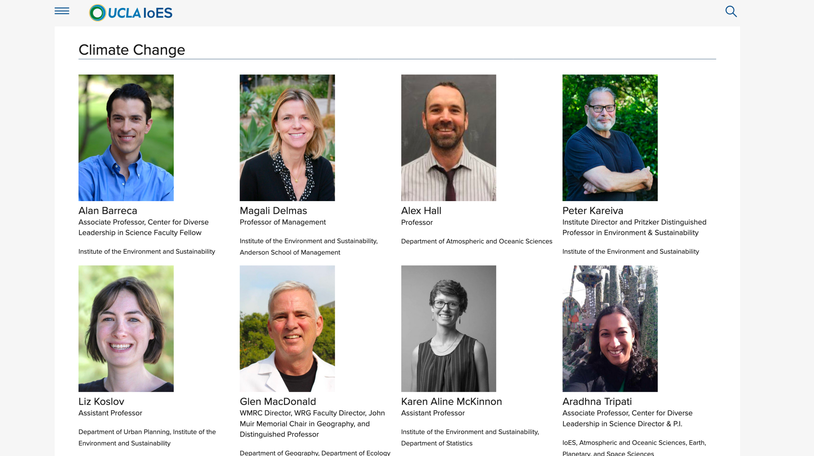
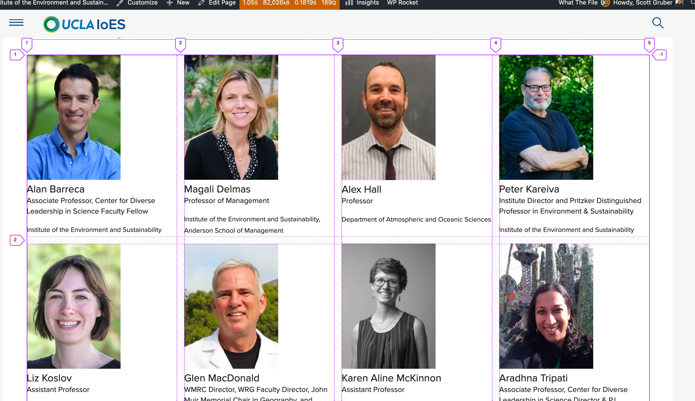
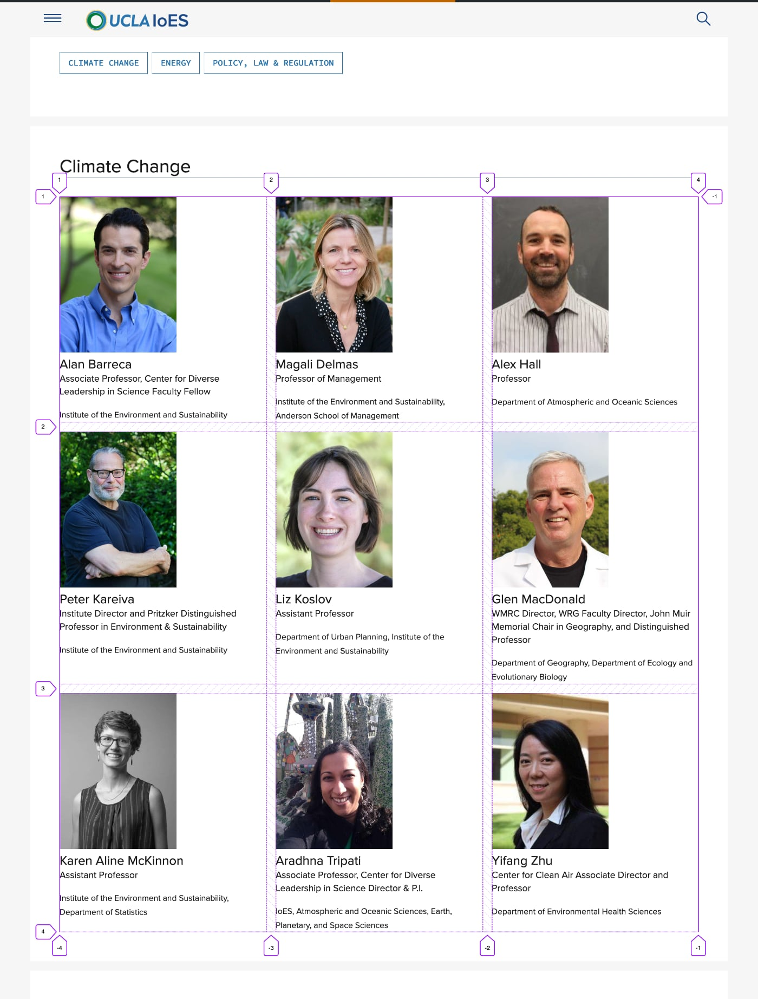
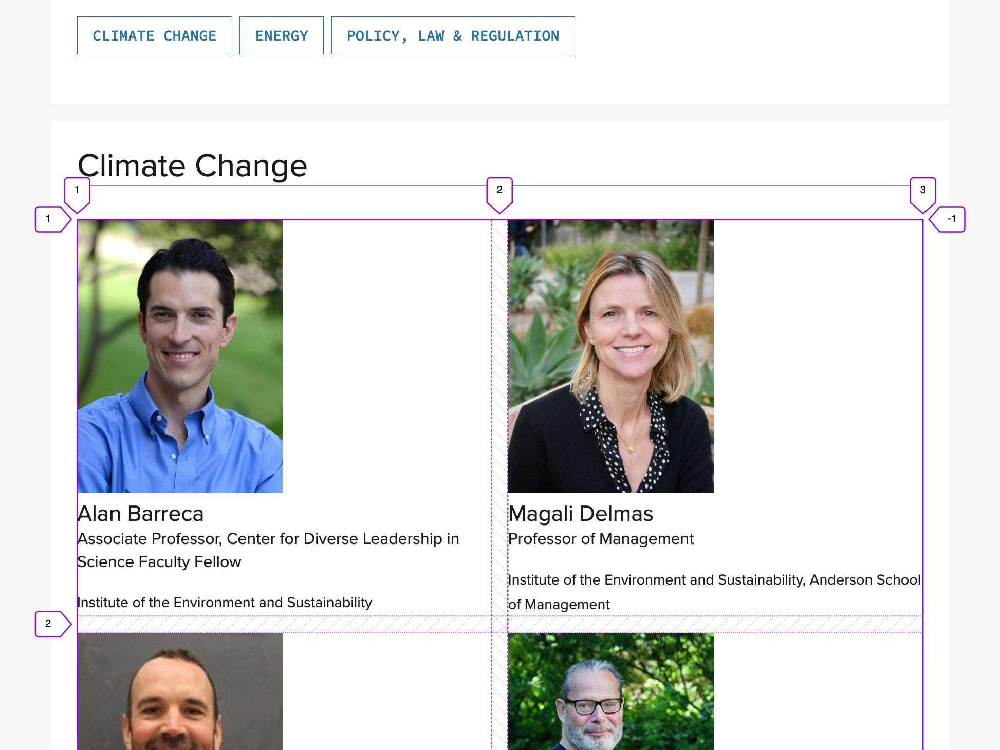
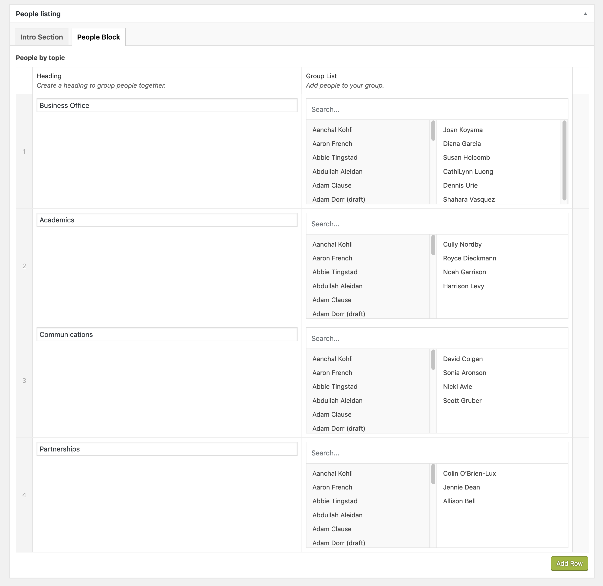
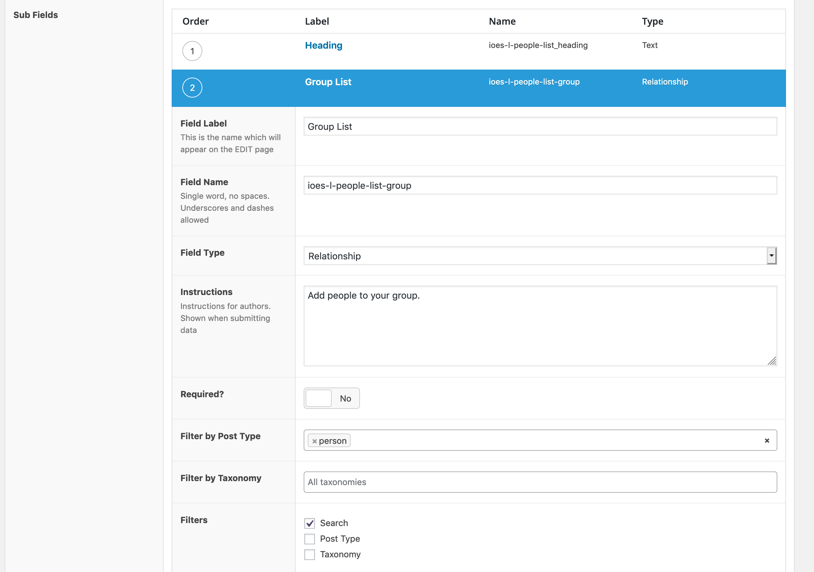
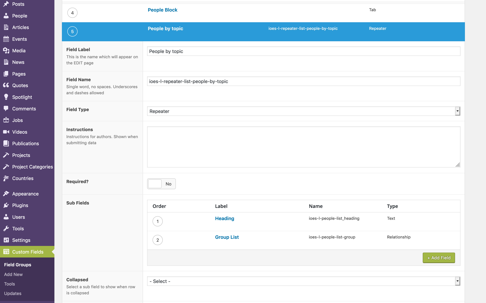
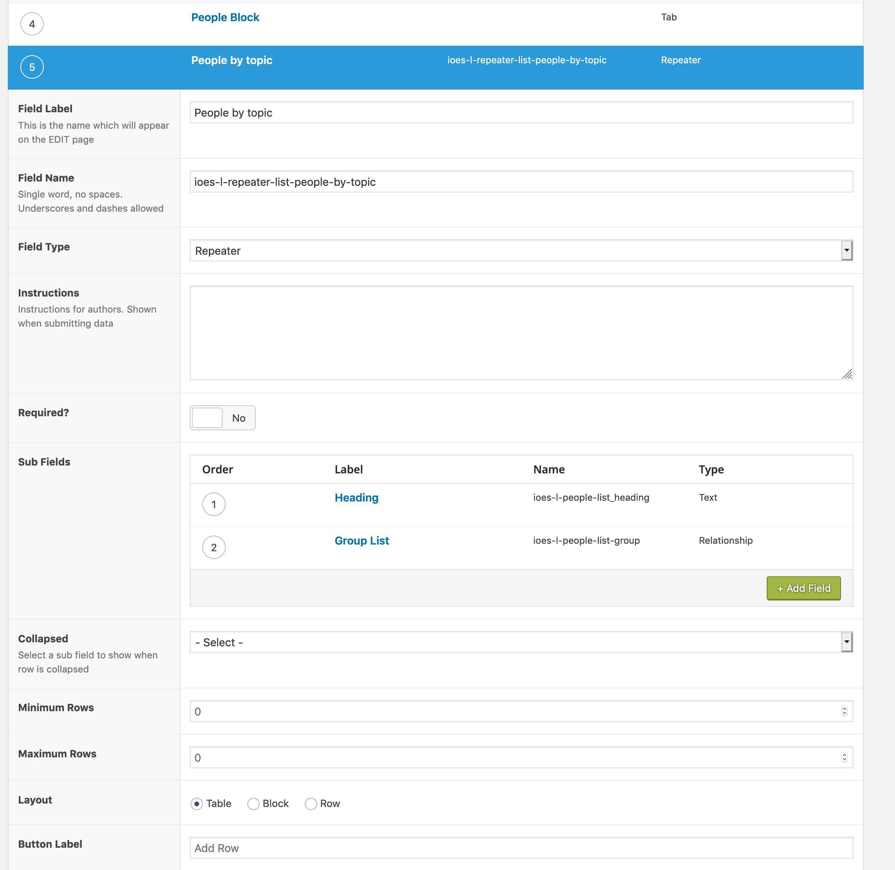

footer: [speaking.scottgruber.me](https://speaking.scottgruber.me) @ West LA WordPress

---

#[fit] Working with WordPress at UCLA

---

 

---

[.hide-footer]
 

--- 

[.hide-footer]
 

---

# [fit] Web design ethics.

---

# [fit] A11y

---

# [fit] Performance
 
---

# [fit] Aesthetics


^ works for everybody

---

# [fit] Sites must work for everybody, load fast and look good.

---

# [fit] How do we get there?

---

# [fit] Structured content 
# [fit] Advanced Custom Fields
# [fit] CSS Layouts


---
# [fit]  

^ Semantic markup and microformats

---

# [fit]  


^ Flexbox, multi-column layout and CSS Grid

--- 

#   

--- 

 

---

# [fit] HTML

Semantic markup and microformats.

--- 

[.hide-footer]



---

```html

<nav class="ucla-c-topic-nav">
<ul> 
	<li><a href="#climate-change">Climate Change</a></li>
	<li><a href="#energy">Energy</a></li>
	<li><a href="#policy-law-regulation">Policy</a></li>
	<li><a href="#sustainability">Sustainability</a></li>
</ul>
</nav> 

```

 ---

# [fit] Flexbox

---

```css

.ucla-c-topic-nav ul { 
	display: flex; 
	flex-direction: column; 
	list-style: none;
	}

@media screen and (min-width: 30em) { 
	.ucla-c-topic-nav ul { 
		display: flex;
		flex-direction: row;
		flex-wrap: wrap;
  }
} 
```

---

[.hide-footer]


---


```html

<h2><a id="climate-change"></a>Climate Change</h2>

<div class="ucla-c-faculty-advisors">
	<ul>
		<li><a href="#">Alan Barreca</a></li>
		<li><a href="#">Alex Hall</a></li>
		<li><a href="#">Peter Kareiva</a></li>
		<li><a href="#">Liz Koslov</a></li>
		<li><a href="#">...</a></li>
		<li><a href="#">...</a></li>
	</ul>
</div>

``` 

---

# [fit] Multi-Column

---

```css

@media screen and (min-width: 30em) { 
	.ucla-c-faculty-advisors > ul {
		column-count: 3; column-gap: 1em;
  	}
  }
  
@media screen and (min-width: 60em) { 
	.ucla-c-faculty-advisors > ul {
		column-count: 5; column-gap: 1em;
  }
}

```

---

[.hide-footer]



---

# [fit] HTML5 & Microformats 

---


```html

<div class="ucla-c-people-grid">
	<article class="h-card">
		<a class="u-url" href="#"> 
		<figure>
			
			<figcaption>
			<h2 class="fn p-name">Kitty Doe</h2> 
			<p class="p-job-title">Assistant Professor</p>
			<small class="p-org">Institute of the Environment and Sustainability</small>
			</figcaption>
		</figure>
		</a>
	</article>
</div>

``` 

---
#[fit] CSS Grid

---

```css

.ucla-c-people-grid { 
	display: grid; 
	grid-gap: 2vw; 
	grid-template-columns: repeat(auto-fit, minmax(300px, 1fr)); 
	grid-template-rows: auto;
}
```

---


[.hide-footer] 


--- 

[.hide-footer] 


---

[.hide-footer]  
 


--- 

[.hide-footer] 


---
# [fit]RWD
*responsive by default with no media queries*

---


```css

.ucla-c-people-grid { 
	display: grid; 
	grid-gap: 2vw; 
	grid-template-columns: repeat(auto-fit, minmax(300px, 1fr)); 
	grid-template-rows: auto;
}
```

---

```css

/* fall back if no grid support */
.ucla-c-people-grid > article { 
	display: inline-block; 
	margin: 1em;
	vertical-align: top; 
	width: 300px;
}


.ucla-c-people-grid > img { 
	height: auto; 
	width: 200px;
}


``` 
---

```css

@supports (display: grid) {

    .ucla-c-people-grid { 
    	display: grid; 
    	grid-gap: 2vw; 
    	grid-template-columns: repeat(auto-fit, minmax(300px, 1fr)); 
    	grid-template-rows: auto;
    }
    
    /* reset properties */
    .ucla-c-people-grid > article { 
    	margin: initial; 
    	width: initial;
    }
```
---

# [fit] Editors

----

# Advanced Custom Fields

[.hide-footer] 




--- 

[.hide-footer] 




--- 

[.hide-footer] 



--- 

[.hide-footer] 



---


[.hide-footer]


---

# [fit] PHP

---


```html

<?php 
	$count = count(get_field('ioes-l-repeater-list-people-by-topic'));
	if ( have_rows('ioes-l-repeater-list-people-by-topic') && $count > 1 ): ?>

<nav class="topic-nav">
<ul>
<?php while ( have_rows('ioes-l-repeater-list-people-by-topic') ) : the_row();
	$posts = get_sub_field('ioes-l-people-list-group');
	
	if( $posts ):
		$ioes_l_people_list_heading = esc_html( get_sub_field('ioes-l-people-list_heading') );

		if( get_sub_field('ioes-l-people-list_heading') ): 
	?>
		<li>
		<a href="#<?php echo sanitize_title($ioes_l_people_list_heading); ?>">
		<?php echo $ioes_l_people_list_heading; ?></a></li>
	
	<?php ... ?>
</ul>
</nav>
	
```

---


[.code-highlight: 2-3]

```html

<?php 
	$count = count(get_field('ioes-l-repeater-list-people-by-topic'));
	if ( have_rows('ioes-l-repeater-list-people-by-topic') && $count > 1 ): ?>

<nav class="topic-nav">
<ul>
<?php while ( have_rows('ioes-l-repeater-list-people-by-topic') ) : the_row();
	$posts = get_sub_field('ioes-l-people-list-group');
	
	if( $posts ):
		$ioes_l_people_list_heading = esc_html( get_sub_field('ioes-l-people-list_heading') );

		if( get_sub_field('ioes-l-people-list_heading') ): 
	?>
	<li><a href="#<?php echo sanitize_title($ioes_l_people_list_heading); ?>">
	<?php echo $ioes_l_people_list_heading; ?></a></li>
	<?php ... ?>
</ul>
</nav>
	
```

---


[.code-highlight: 7-11]

```html

<?php 
	$count = count(get_field('ioes-l-repeater-list-people-by-topic'));
	if ( have_rows('ioes-l-repeater-list-people-by-topic') && $count > 1 ): ?>

<nav class="topic-nav">
<ul>
<?php while ( have_rows('ioes-l-repeater-list-people-by-topic') ) : the_row();
	$posts = get_sub_field('ioes-l-people-list-group');
	
	if( $posts ):
		$ioes_l_people_list_heading = esc_html( get_sub_field('ioes-l-people-list_heading') );

		if( get_sub_field('ioes-l-people-list_heading') ): 
	?>
	<li><a href="#<?php echo sanitize_title($ioes_l_people_list_heading); ?>">
	<?php echo $ioes_l_people_list_heading; ?></a></li>
	<?php ... ?>
</ul>
</nav>
	
```

---


[.code-highlight: 13-16]

```html

<?php 
	$count = count(get_field('ioes-l-repeater-list-people-by-topic'));
	if ( have_rows('ioes-l-repeater-list-people-by-topic') && $count > 1 ): ?>

<nav class="topic-nav">
<ul>
<?php while ( have_rows('ioes-l-repeater-list-people-by-topic') ) : the_row();
	$posts = get_sub_field('ioes-l-people-list-group');
	
	if( $posts ):
		$ioes_l_people_list_heading = esc_html( get_sub_field('ioes-l-people-list_heading') );

		if( get_sub_field('ioes-l-people-list_heading') ): 
	?>
	<li><a href="#<?php echo sanitize_title($ioes_l_people_list_heading); ?>">
	<?php echo $ioes_l_people_list_heading; ?></a></li>
	<?php ... ?>
</ul>
</nav>
	
```

---


```html 
<div class="ioes-l-people-group-grid">
	<?php foreach ( $posts as $post ):  // variable must be called $post (IMPORTANT) ?>
		
	<article class="h-card">
		<?php setup_postdata($post); ?>
		<a class="u-url" href="<?php the_permalink(); ?>">
		<div class="u-photo">
		<?php the_post_thumbnail( '3x4' ); ?>
		</div>
		<h4 class="fn p-name"><?php the_title(); ?></h4>
		</a>
		<?php if( get_field('people_title') ): ?>
		<p class="p-job-title"><?php echo esc_html( get_field( 'people_title' ) ); ?></p>
		<?php endif; ?>
				<?php if( get_field('people-entity-department') ): ?>
				<small class="p-org"><?php echo esc_html( get_field( 'people-entity-department' ) ); ?></small>
				<?php endif; ?>
		</article>
	
	<?php endforeach; ?>

```

---

[.code-highlight: 1-6]

```html 
<div class="ioes-l-people-group-grid">
	<?php foreach ( $posts as $post ):  // variable must be called $post (IMPORTANT) ?>
		
	<article class="h-card">
		<?php setup_postdata($post); ?>
		<a class="u-url" href="<?php the_permalink(); ?>">
		<div class="u-photo">
		<?php the_post_thumbnail( '3x4' ); ?>
		</div>
		<h4 class="fn p-name"><?php the_title(); ?></h4>
		</a>
		<?php if( get_field('people_title') ): ?>
		<p class="p-job-title"><?php echo esc_html( get_field( 'people_title' ) ); ?></p>
		<?php endif; ?>
				<?php if( get_field('people-entity-department') ): ?>
				<small class="p-org"><?php echo esc_html( get_field( 'people-entity-department' ) ); ?></small>
				<?php endif; ?>
		</article>
	
	<?php endforeach; ?>

```

---


[.code-highlight: 7-18]

```html 
<div class="ioes-l-people-group-grid">
	<?php foreach ( $posts as $post ):  // variable must be called $post (IMPORTANT) ?>
		
	<article class="h-card">
		<?php setup_postdata($post); ?>
		<a class="u-url" href="<?php the_permalink(); ?>">
		<div class="u-photo">
		<?php the_post_thumbnail( '3x4' ); ?>
		</div>
		<h4 class="fn p-name"><?php the_title(); ?></h4>
		</a>
		<?php if( get_field('people_title') ): ?>
		<p class="p-job-title"><?php echo esc_html( get_field( 'people_title' ) ); ?></p>
		<?php endif; ?>
				<?php if( get_field('people-entity-department') ): ?>
				<small class="p-org"><?php echo esc_html( get_field( 'people-entity-department' ) ); ?></small>
				<?php endif; ?>
		</article>
	
	<?php endforeach; ?>

```

---


# What did we cover?

---


[.hide-footer]


# CSS, HTML, PHP and WordPress

---


[.hide-footer] 


--- 


# What are you working on?

---

[.hide-footer]
 


---

# Thank you.


